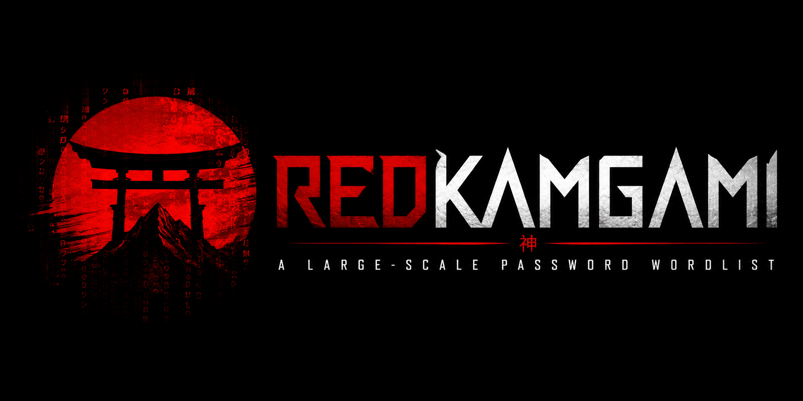

# RedKamgami

<p align="center">
  
  </p>
</p>

### 4 GB (≈2 GB compressed) • 300M+ passwords • Duplicate-free • 6–14 characters passwords

---

## Disclaimer

**RedKamgami is intended exclusively for:**

* Security research
* Authorized penetration testing
* Password auditing
* Academic research
* Defensive cybersecurity activities

The author does **not** encourage or endorse unauthorized access to computer systems, networks, or accounts. Users are solely responsible for ensuring that their use of this project complies with all applicable laws and regulations.

---

# Installation & Usage

RedKamgami supports **Windows**, **Linux**, and **macOS**.

## 1. Download the Launcher

Go to the project's **Releases** page and download the launcher for your operating system.

---

## 2. Make the Launcher Executable (Linux/macOS)

If you're using Linux or macOS, grant execute permission:

```bash
chmod +x RedKamgami-linux-amd64
```

or

```bash
chmod +x RedKamgami-macos-amd64
```

---

## 3. Launch RedKamgami

Run the launcher.

**Windows**

```powershell
.\RedKamgami-windows-amd64.exe
```

**Linux**

```bash
./RedKamgami-linux-amd64
```

**macOS**

```bash
./RedKamgami-macos-amd64
```

---

## 4. Download the Wordlist

From the launcher menu, choose the option `[1] Download RedKamgami`.

The launcher will:

* Check the availability of mirrors;
* Display the list of download mirrors;
* You must choose a mirror to download the wordlist (~2GB compressed);

---

## 5. Place the Downloaded File

After selecting the mirror, the launcher will open the download URL in your browser. You should download the wordlist and move it to the same directory as the launcher.

Example:

```text
RedKamgami/
├── RedKamgami-linux-amd64
└── RedKamgami.zst
```

---

## 6. Extract the Wordlist

After that, the launcher will ask if the word list has been downloaded. You should confirm, and then it will automatically unzip your word list. But for that to happen, the word list must be in the same directory as the launcher!

Result:

```text
RedKamgami/
├── RedKamgami-linux-amd64
└── RedKamgami.txt
```

### That's it! The wordlist is ready to use, and if you don't want the launcher to modify it in any way (splitting, verification, compression, etc.), you can move it to any directory and start using it right away.

---

## Updating

Whenever a new release is available:

1. Launch RedKamgami.
2. The launcher checks for updates automatically.
3. Download the latest compressed wordlist.
4. Replace the old archive (if applicable).
5. Use the launcher to extract the updated version.

No manual decompression tools are required.

---

## Supported Platforms

| Operating System | Supported |
| ---------------- | --------- |
| Windows          | ✅         |
| Linux            | ✅         |
| macOS            | ✅         |

The launcher is distributed as a native executable for each supported platform and requires no additional runtime or dependencies.


# Features

* Massive password collection
* Duplicate-free dataset
* High-performance password generator (Rust)
* Automatic launcher/updater (Go)
* Multiple download mirrors
* SHA-256 integrity verification
* Compressed distribution using Zstandard (.zst)
* Open source
* Cross-platform launcher

---

# Components

## Password Dataset

The primary dataset consists of a curated collection of passwords assembled for research purposes.

The build pipeline includes:

* Dataset merging
* Duplicate removal
* Validation
* Statistics generation
* Compression

---

## Launcher (Go)

The launcher automatically handles:

* Version checking
* Mirror selection
* Download management
* Resume support (when available)
* SHA-256 verification
* Automatic extraction

Supported mirrors may include:

* Google Drive
* MEGA
* MediaFire
* OneDrive
* TeraBox

---

# Compression

The distributed wordlists use **Zstandard (.zst)** to reduce download size while maintaining extremely fast decompression.

---

# Integrity Verification

Every release includes a SHA-256 checksum.

The launcher verifies downloaded files automatically before extraction.

---

# Performance

The password generator is designed for:

* Streaming output
* Buffered file writing
* Minimal memory allocation
* Multi-core CPUs (where beneficial)

---

# Intended Use

RedKamgami is designed for:

* Password auditing
* Security research
* Academic projects
* Digital forensics
* Authorized penetration testing
* Defensive security exercises

---

# License

This project is released under the **Creative Commons Zero 1.0 Universal (CC0 1.0)**.

You are free to:

* Use
* Modify
* Redistribute
* Incorporate into other projects

without restriction.

For full license details, see the LICENSE file.

---

# Repository Policy

This repository is maintained as a personal project.

## Pull Requests

Pull requests are **not accepted**.

## Issues

Issue reports are **disabled**.

Suggestions, feature requests, and bug reports are not tracked through this repository.

---

# Acknowledgements

This project is inspired by the broader cybersecurity research community and by publicly available research on password security, password hygiene, and defensive security testing.

---

# Support

If you find RedKamgami useful, consider giving the repository a ⭐.

---

<p align="center">
Made with Rust, Go, and far too many passwords.
</p>
